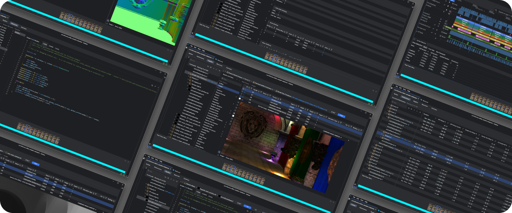
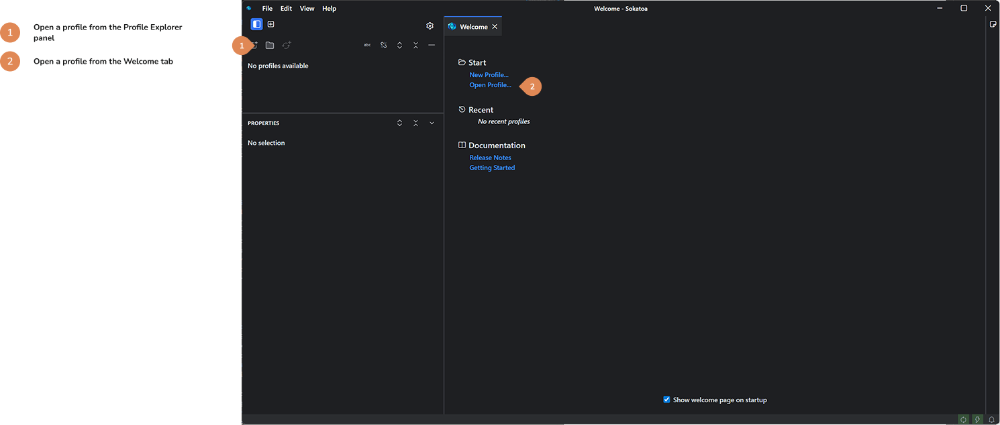
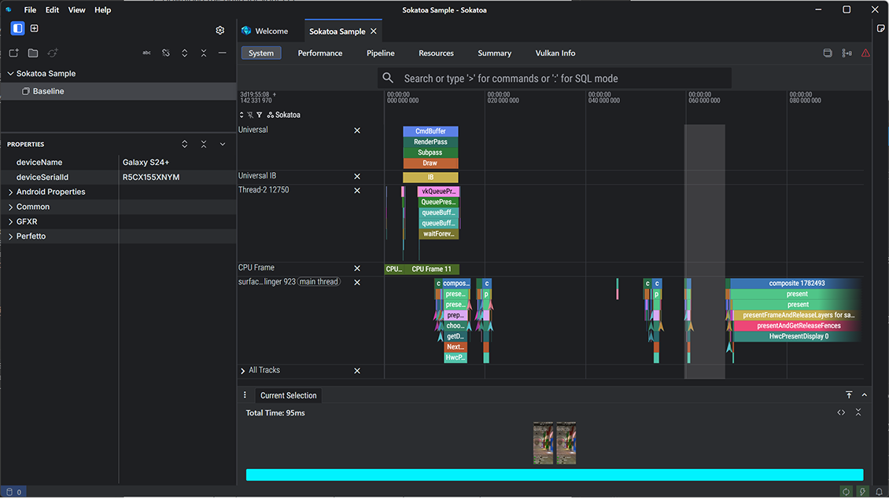
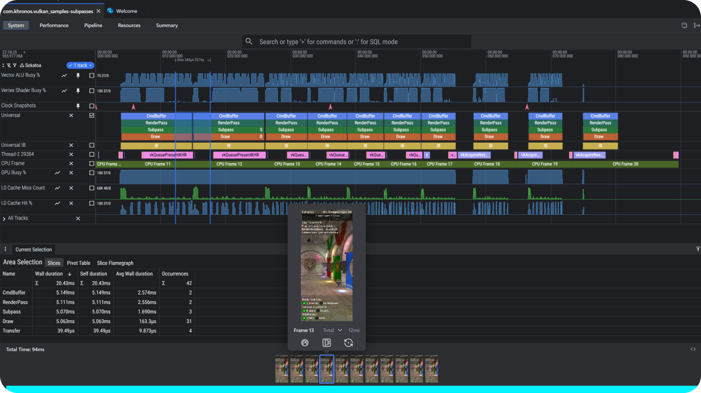
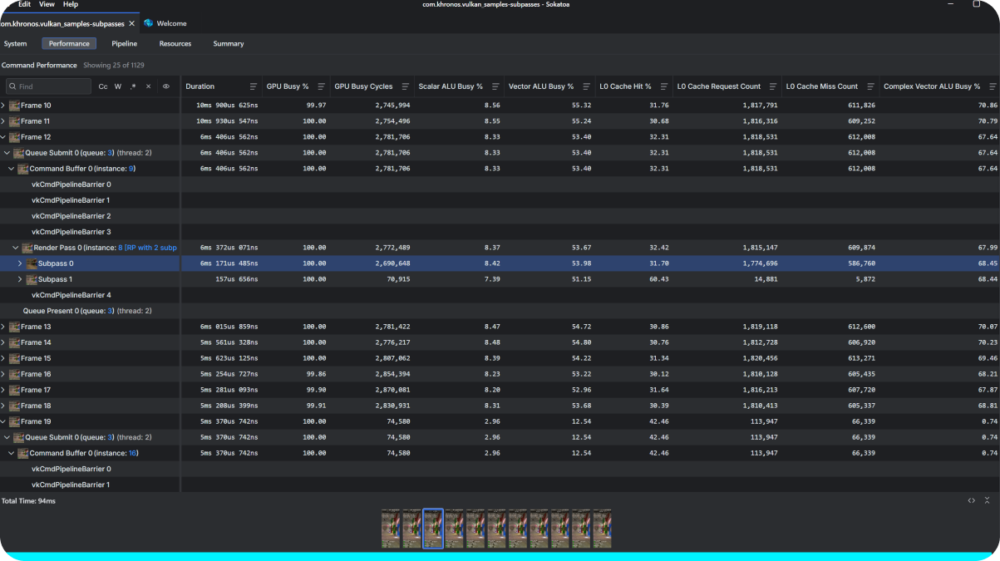
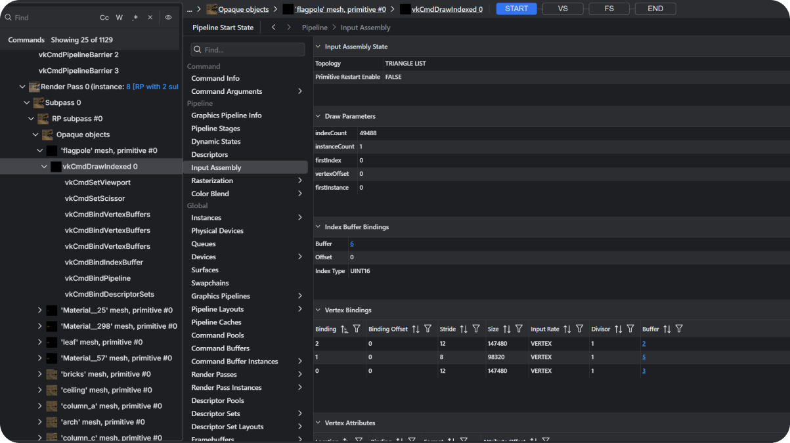
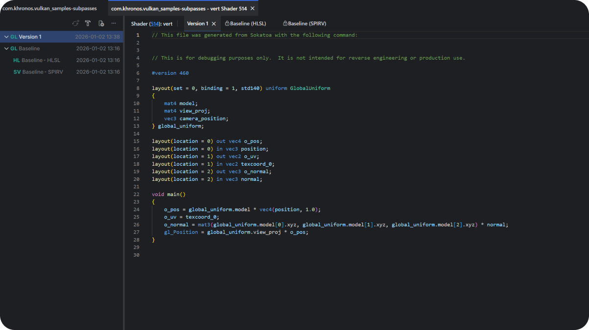

 

    <picture>
        <source media="(prefers-color-scheme: dark)" srcset="./assets-readme/sokatoa-dark.svg" style="width:500px">
        
    </picture>

 

 

Sokatoa is a multi-frame performance profiling and frame debugging tool for Android.  It was designed specifically for Android development and optimized for graphics-intensive mobile games and applications.  Sokatoa supports industry leading GPUs like Samsung’s Exynos, ARM Mali, Qualcomm Adreno and Imagination PowerVR.

#### **Sokatoa is free to download and use.  It will be open-sourced at the end of 2026.**

[Click here](https://discord.gg/7ZQrU9GZc3) to join the Sokatoa Discord channel and use it to give feedback and ask questions.

 

# Installation

1. Validate you meet [the system requirements](#system-requirements)
2. Download the build for your OS.  Sokatoa is free to download and use.
    * [Windows](https://github.com/sarc-acl/sokatoa/releases/download/v1.0.1/Sokatoa-installer-1.0.1.exe)
    * [Linux](https://github.com/sarc-acl/sokatoa/releases/download/v1.0.1/Sokatoa-1.0.1.AppImage)
    * [MacOS](https://github.com/sarc-acl/sokatoa/releases/download/v1.0.1/Sokatoa-1.0.1-arm64.dmg)
3. Quick start: [Download the Sample Profile](https://github.com/sarc-acl/sokatoa/releases/download/v1.0.1/SokatoaSample.zip) and [open it within Sokatoa](#quick-start-opening-the-sample-profile) for the fastest way to explore the tool
4. Read the [Getting Started documentation](docs/user/getting-started.md)
5. Accept [our invite to join the Sokatoa Discord channel](https://discord.gg/7ZQrU9GZc3)

 

# Quick Start: Opening the Sample Profile
1. [Download the Sample Profile](https://github.com/sarc-acl/sokatoa/releases/download/v1.0.1/SokatoaSample.zip)
2. Extract the contents to a new folder named `sokatoa-sample`.  The destination is not critial to Sokatoa, but place it somewhere convenient to find.  By default, Sokatoa stores profiles in the host account folder in a sub-folder named `sokatoa\profiles`.  For example, on Windows the path would be `C:\Users\{{account name}}\sokatoa\profiles`.
3. Launch Sokatoa
4. Open the sample profile

5. Open the `profile.sokatoa` file within the profile's folder

 

At the end of step five, Sokatoa will show the profile in the **System** view.  This profile has two frames of data.  At this point, you are free to explore the tool.  See the [Getting Started documentation](docs/user/getting-started.md) for areas of interest.

 

 

# System Requirements
##### Supported host platforms
-   macOS: macOS 14 or later (Apple silicon)
-   Linux: Ubuntu 22.04 or later
-   Windows: Windows 10 or later
##### Host setup
-   ADB installed and the containing directory listed in the path environment variable
-   Device connected to ADB (USB or Wi-Fi) - requires developer mode and USB debugging enabled for USB connection
##### Target device
-   Android 13 or later
-   Debuggable APK or rooted device required for GFXR, Sokatoa Vulkan layers
-   For performance view data, Xclipse, Mali, Adreno or PowerVR GPU required

 

# Overview
Sokatoa exists to fix the gap of GPU tooling for Android, and to make performance profiling and frame debugging easier than it is today.

GPU profiling is about understanding why a frame did not render as expected or why render performance did not satisfy some rubric.  Finding answers for these questions is anything but simple; GPU profiling is notoriously challenging.  The whole process, from capturing data to finding what problems exist within a massive data set to determining the cause of the problem, is arduous, awkward, and demands lots of cognitive focus.  Android developers often have to use multiple apps, because the ecosystem’s current tools either have limited profiling scope or can only inspect a single frame at a time.

Sokatoa was developed to address these workflow challenges.  The primary goal is to improve developer efficiency in finding and determining the cause of graphics performance issues.  Here are some of Sokatoa's innovative features.

  
### Key Features

##### Multi-frame data capture
Analyze rendering behavior across multiple frames to uncover intermittent, frame-to-frame performance issues that are difficult to detect with single-frame capture tools.  Sokatoa supports multi-frame analysis for both system-level profiling and frame-level profiling.

##### Multi-perspective insights
Sokatoa captures data to support both performance profiling and frame debugging.  By capturing data from all perspectives developers do not need to switch between multiple tools.  Developers can review system- and frame-level Vulkan API events, pipelines, and shader performance.

##### Rich data sets and visualizations
Developers can capture high fidelity data on CPU, GPU, and memory usage, as well as rich data from Vulkan API calls.  Sokatoa makes navigating and making sense of the data easy.

##### Fast iteration through shader editing and on-device replay  
Developers can edit shaders, replay workloads directly on device, and compare results instantly—dramatically shortening the optimize-test-iterate loop for graphics and game development.  

##### Extension-First Architecture for Custom GPU Insights
Sokatoa is designed to be extensible from day one, allowing GPU vendors, third-party tool developers, and studios to build custom extensions—similar to VS Code plugins—for producing metrics, analysis panels, and workflow automation.

##### Vulkan and Android focused
Sokatoa was built to support Android games and applications using Vulkan.  It enables modern workflows to ensure data accuracy, metric relevance and forward compatibility.  Later this year, Samsung will release a Sokatoa extension that enhances and optimizes profiling of Samsung GPUs for Android devices.

  
### Origins
Sokatoa originated from [Samsung Austin Research Center (SARC)](https://semiconductor.samsung.com/about-us/locations/us-rnd-labs/computing-lab-sarc-acl/), a division of Samsung Semiconductor, and developed in collaboration with [Google](https://www.android.com/) and [LunarG](https://www.lunarg.com/).  SARC remains the application's primary steward pushing feature innovation and development. 

