 

# After-Getting Started with Sokatoa

 

Before jumping into this documentation, it is best to read the [Getting Started documentation.](./getting-started.md)

 

## Profile configuration details
#### Common

This tab contains the common capture options.

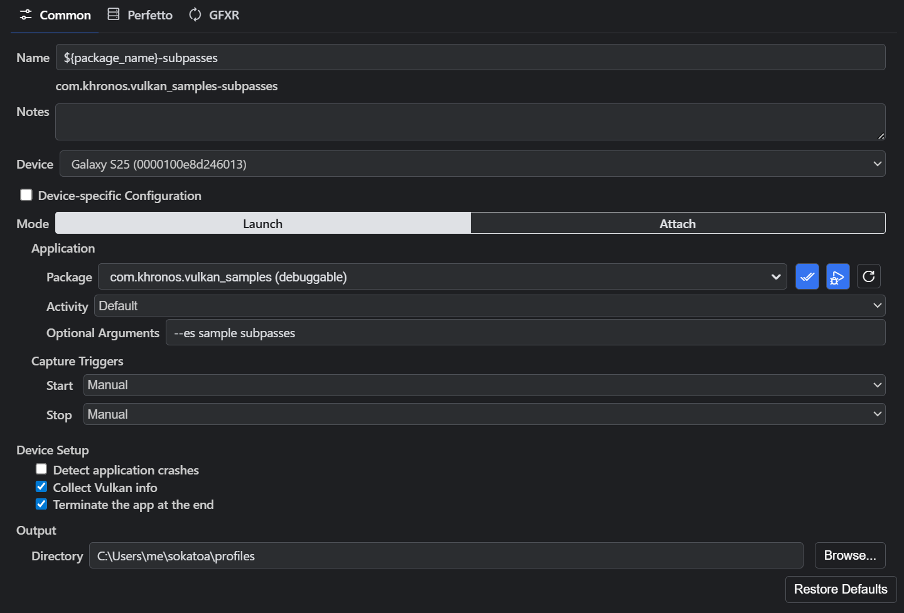

-   **Name**: The name of the profile to create. This is the name that will be shown in the profile explorer and the name of the profile directory. The default is a variable expression `${package_name}\_${capture_triggers}\_${device}`, which will use the name of the selected package, the capture triggers, and device ID. See below for a list of the available variables in the different contexts for new captures.
-   **Notes**: You can optionally add notes here which will be added to the profile's notebook.
-   **Device**: Select the device you wish to capture from. This uses ADB to get the list of connected devices.
-   **Device-specific Configuration**: Check this when the configuration is specific to the currently connected device. Doing so will prevent the device selector from automatically selecting another connected device when this device is not connected.
-   **Mode**:
    -   **Launch**: Launch the selected package/activity on the device with the given arguments.
    -   **Attach**: Just attach to the device and capture without launching a package/activity. NOTE: GFXR capture requires starting a package/activity as the Vulkan API is tracked from application start. Therefore, you can only capture Perfetto data in this mode.
-   **Capture Triggers**:
    -   **Start**:
        -   **Manual**: The capture will start when you press the start button on the capture progress dialog.
        -   **Delay since app launch**: The capture will start in the given number of milliseconds after the application was started.
        -   **Frame (inclusive)**: The capture will start when the given frame is rendered. Frames numbers start at 1.
    -   **Stop**:
        -   **Manual**: The capture will stop when you press the stop button on the capture progress dialog.
        -   **Duration since capture start**: The capture will stop in the given number of milliseconds after the capture was started.
        -   **Frame (inclusive)**: The capture will stop after the given frame is rendered.
-   **Device Setup**:
    -   **Detect application crashes**: When enabled, application crashes are detected using 'am monitor' and the crash details will be saved as a file in the created profile.
    -   **Collect Vulkan info**: When enabled, Vulkan information will be retrieved from the device using feature enumeration and displayed in the Vulkan Info tab in the capture view.
    -   **Terminate the app at the end**: When enabled, the app will be terminated at the end of the capture.
-   **Output Directory**: The location on disk at which to create the profile.

##### New Profile Name Variables

| Variable Name    | New Profile | New Replay | Arguments | Description                                                                                                                                                                              |
| ---------------- | ----------- | ---------- | --------- | ---------------------------------------------------------------------------------------------------------------------------------------------------------------------------------------- |
| activity         | ✔️          |            | N/A       | The name of the activity that is launched, or "Default" for the package's default activity.                                                                                              |
| capture_triggers | ✔️          | ✔️         | N/A       | A précis of the capture triggers, e.g., "manual", "frames_1000-1050", or "from_1000ms_to_1500ms"                                                                                          |
| device           | ✔️          | ✔️         |           | Information about the device on which the capture is performed, selected by the argument. Without any argument, expands to the device identifier, e.g., `${device}` for "21231JEGR02186". |
|                  |             |            | id        | The device identifier, e.g., `${device:id}` for "21231JEGR02186".                                                                                                                         |
|                  |             |            | name      | The device name, e.g., `${device:name}` for "My Pixel 6a".                                                                                                                                |
| mode             | ✔️          |            | N/A       | The capture mode, either "launch" or "attach".                                                                                                                                           |
| package_name     | ✔️          |            | N/A       | The name of the selected package. Replays always use the replay application.                                                                                                             |
| timestamp        | ✔️          | ✔️         |           | The date and time when the capturing process was initiated, in YYYYMMDDHHmmss format, e.g., 20250312112100.                                                                               |
|                  |             |            | -         | The timestamp in hyphenated format, e.g., 2025-03-12_11-21-00                                                                                                                             |
|                  |             |            | iso       | The timestamp in ISO 8601 format, e.g., 2025-03-12T11:21:00.523Z                                                                                                                          |
|                  |             |            | locale    | The timestamp in JavaScript locale-specific format, e.g., 3/12/2025, 11:21:00 AM                                                                                                          |
|                  |             |            | utc       | The timestamp in JavaScript UTC format, e.g., Wed, 12 Mar 2025 15:21:00 GMT                                                                                                               |

#### Perfetto

This tab contains the Perfetto capture options.

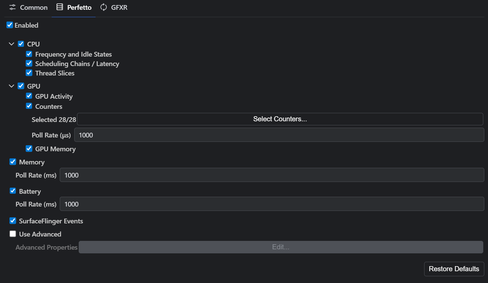

-   **Enabled**: When enabled, Perfetto data will be captured. This will enable the system view of the profile which contains data from both the CPU and GPU.

Perfetto capture adds some overhead but it's minor.

The default values for the rest of the settings should be fine for most users. You can uncheck certain types of data that you're not interested in. You can select which performance counters to collect. Advanced users can edit the Perfetto configuration directly. See <https://perfetto.dev/docs/concepts/config> for more information.

#### GFXR

This tab contains the GFXR capture options.

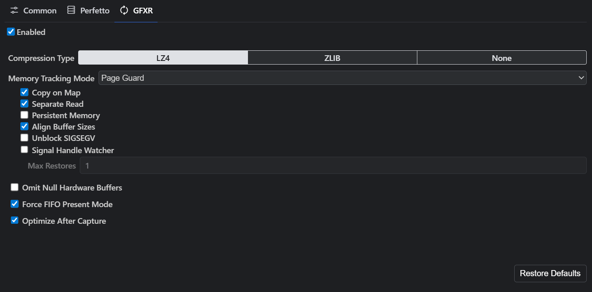

-   **Enabled**: When enabled, GFXR data will be captured. This will enable the performance, pipeline and resources views of the profile. It also enables fetching screenshots, images, mesh and other data for certain events, and allows replaying with shader replacement. NOTE: As GFXR requires the use of a Vulkan validation layer, the target APK must be debuggable or the device must be rooted.

GFXR capture can add significant overhead (~30%). We are working to reduce that overhead, but it will never be negligible as it must record all Vulkan API calls and data in order to support replay. Keep this in mind when looking for performance issues. It is recommended to perform an initial baseline capture that includes GFXR and then perform a replay of the captured baseline to evaluate graphics performance as replays do not include the GFXR overhead experienced during baseline capture. Alternatively, you may want to capture Perfetto only for system level performance analysis.

The default values for the rest of the settings should be fine for most users. For more information on the GFXR settings, please see <https://github.com/LunarG/gfxreconstruct/blob/dev/USAGE_android.md>.

If your app installs its own signal handlers, or you use a third-party crash reporter SDK, they may conflict with GFXR's memory tracking modes Page Guard and User Fault FD.

 

## Vulkan information

If you choose to collect Vulkan info when capturing your app, an additional view tab will appear. This provides information related to the Vulkan features and capabilities of the captured device. This is similar to running vulkaninfo.exe on a host machine that supports Vulkan.

You can also capture Vulkan info on replays, however if you are capturing a replay on the same device as your original capture without any changes to your driver, this is usually unnecessary as the Vulkan info of the baseline capture will be used if one is not present in the replay. If you do not capture a Vulkan info in your replay and it is on a different device, the Vulkan info panel will warn you if there is a device id mismatch.

 

## Shader editing

The shader view shows disassembled and cross-compiled shaders. Note this is not the original shader code used by the application, but a best guess based on the binary SPIR-V captured by GFXR. Disassemble and cross-compilation settings can be found under the Sokatoa -> Shader -> Disassemble section of the settings panel.

To edit the shader for shader replacement during replay, select the tab of the shader language you would like to edit first, and then click on the edit icon at the top right. This will open an editor for that shader with a new version created for you. It's named Version 1 by default, but you can rename it to whatever you like.

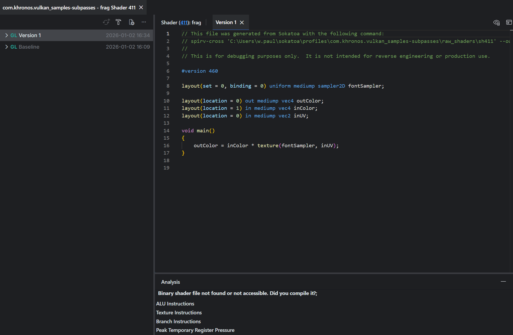

Edit the shader and save using Ctrl+S. This will trigger automatic shader compilation back to SPIR-V. The result will appear in the notifications area. The version entry in the table will also turn green when compilation was successful and red when it fails. By default, Sokatoa will use glslc or dxc compilers to compile the shader depending on the high-level language. glslang is also a supported shader compiler. Shader compiler settings can be found in Sokatoa -> Shader -> General section of the settings panel. You can also use the hamburger menu to open the compile dialog where you can customize the compiler settings.

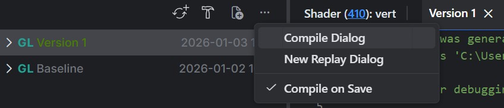

You can create as many versions as you wish. To create a new version, click the new version icon and select the source of the new version.

You can also create a new version with the real shader source if you have it by clicking on the new version icon and selecting from file.

 

### Replays

A replay uses GFXR to replay the profile on the device. This allows the tool to capture new Perfetto data and new screenshots. You can replay the entire baseline, a slice, or one or more selected frames. If you have modified one or more shaders, you can choose which modified shaders to use during the replay. This allows you to see differences in both rendering and in performance.

Note that GFXR replays start from the beginning of the capture regardless of which replay region is selected. For long captures you may notice some activity before the replay region is shown on the device. Data is only collected for the replay region and the replay timeline will be limited to the region selected.

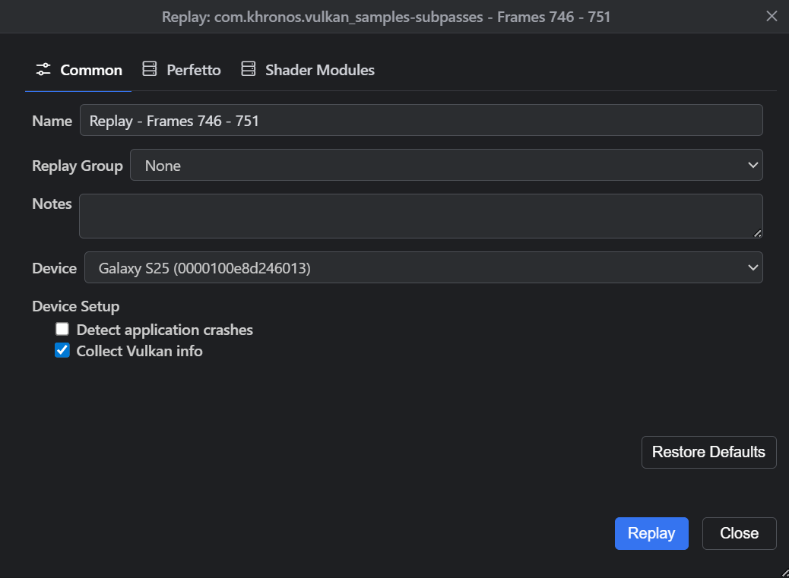

 

## Comparisons

You can compare the baseline with a replay or a replay with a replay. Simply select the two nodes in the profile explorer that you want to compare, right-click and select compare.

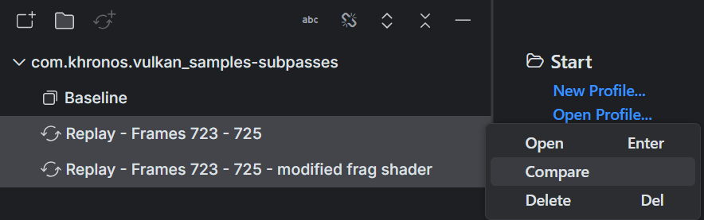

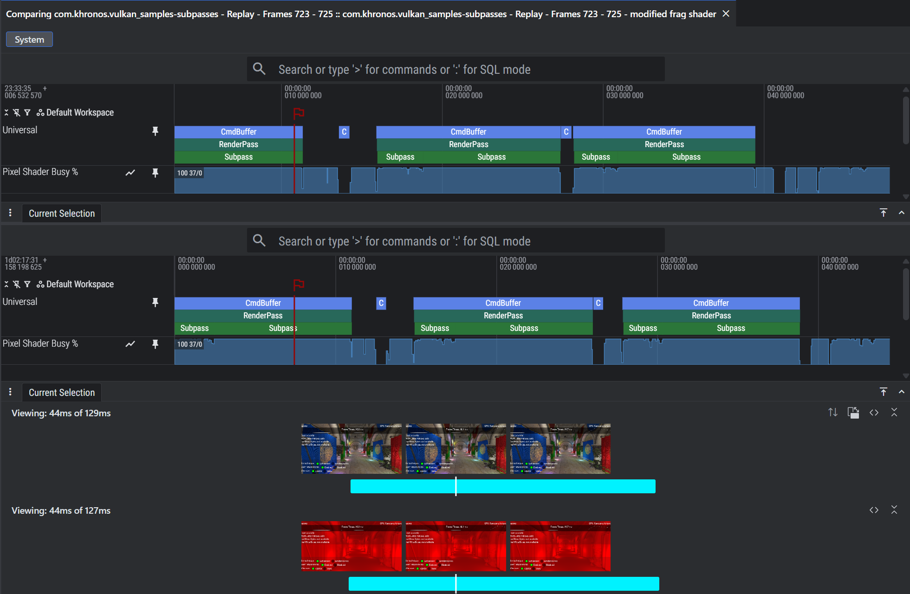

The two timelines are automatically synced and remain in sync as you zoom and pan. Depending on the shader changes, you may see visual differences in the frames or changes in frame performance.

The comparison toolbar provides some functions in addition to the normal timeline toolbar. The first button allows you to switch the order of the comparison views. This will also switch the order of the stacked timelines. The second button allows you to flip the orientation of the comparison from horizontal to vertical. The last two buttons are the same as the timeline toolbar.

 

## A few other interesting things

### The timeline component

The timeline shows both the overall timeline of the profile and the current range. When the profile contains GFXR data you will see the frame thumbnails as well. You can drag either side of the range selector to update the current range. You can use the mouse wheel on the range selector to zoom in/out. You can drag the range selector pan left/right.

You can hover over a frame thumbnail to see the frame details. This gives you a larger view of the frame thumbnail and lets you see that frame in other views or replay that frame. Replaying a frame uses GFXR to replay the frame and capture new Perfetto data.

You can create a slice by drag-selecting or shift-clicking frames and then right-clicking and selecting "Create New Slice". A slice is just a new view of the data that's filtered to a specific frame range. Both Perfetto and GFXR data will be filtered to the slice's configured frame range. You can select slices from the timeline toolbar.

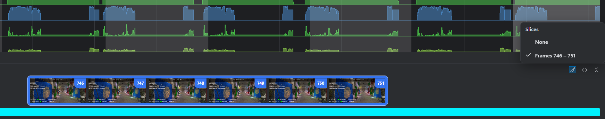

Double clicking on a frame thumbnail will zoom the timeline to that frame. Right clicking on the thumbnail provides additional navigation, slice and replay functionality.

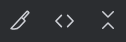

The timeline toolbar provides some buttons for useful features. The first button is the previously mentioned slice selector. Select None for to show the entire timeline, or select a slice to filter the view to that range of frames. The second button will re-expand the timeline to the full length of the capture, or of the slice if one is applied. This makes it easy to quickly zoom out to see the full timeline. The third button hides/shows the frame thumbnails section of the timeline, providing additional vertical space to see the other views.

 

### Notebook

The notebook view contains notes and annotations about the selected profile. The notebook is stored with the profile and can therefore be shared.

#### Notes

Notes taken when creating a profile or replay are shown here. You can also add more as you investigate the profile.

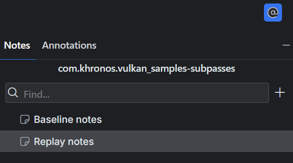

#### Annotations

Annotations are notes that are attached to some UI element in the profile. Currently, you can only create annotations on command tree nodes, but we will extend that in the future. You can create an annotation from the context menu.

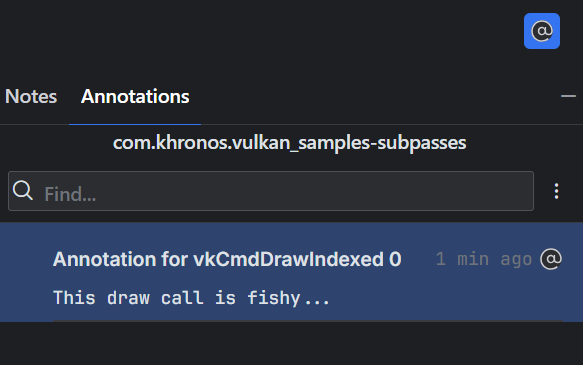
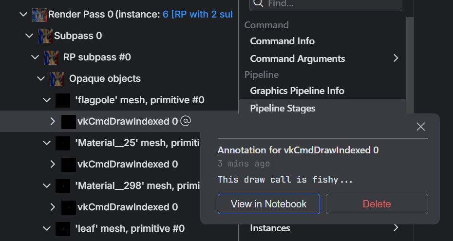

 

### Status Bar

The status bar contains status icons and actions. From left to right:

-   **GFXR Status**: Indicates status of GFXR interactions like replays (red indicates an error has occurred). Clicking on it will open the GFXR output view.
-   **Shader Status**: Indicates status of shader tool interactions like compilation (red indicates an error has occurred). Clicking on it will open the shader output view.
-   **Notifications**: Errors, warnings and information messages are displayed here.
-   **Toggle Bottom Panel**: Show hide the bottom panel, which by default contains the output view.

 

### Customization

You can customize both the appearance and behavior of Sokatoa.

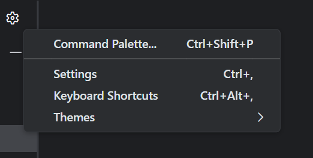

#### Settings

The default settings should suffice for most users. Feel free to explore and see all of the available settings.

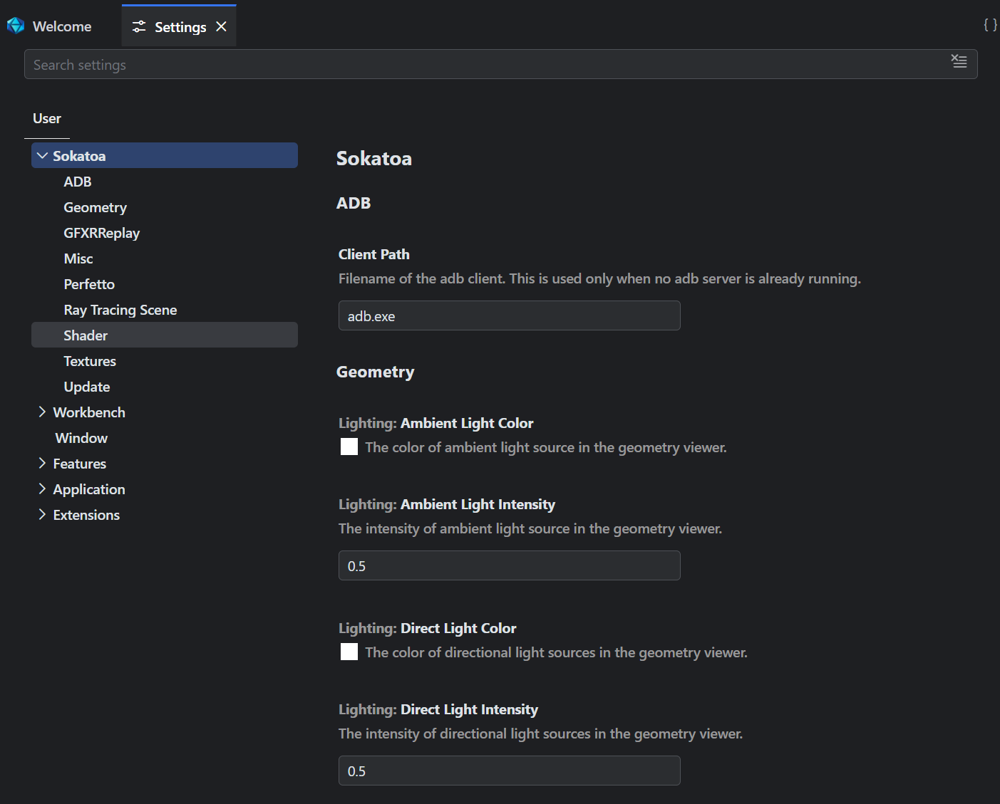

#### Other

You can further customize things like color themes and keyboard shortcuts.

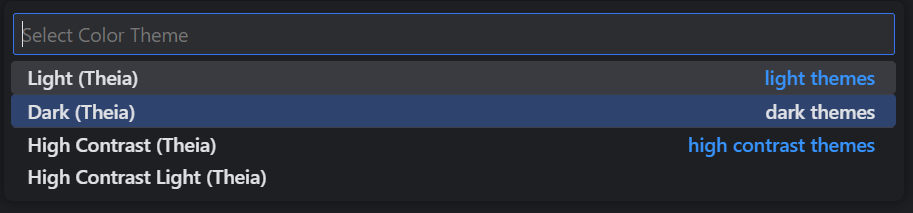

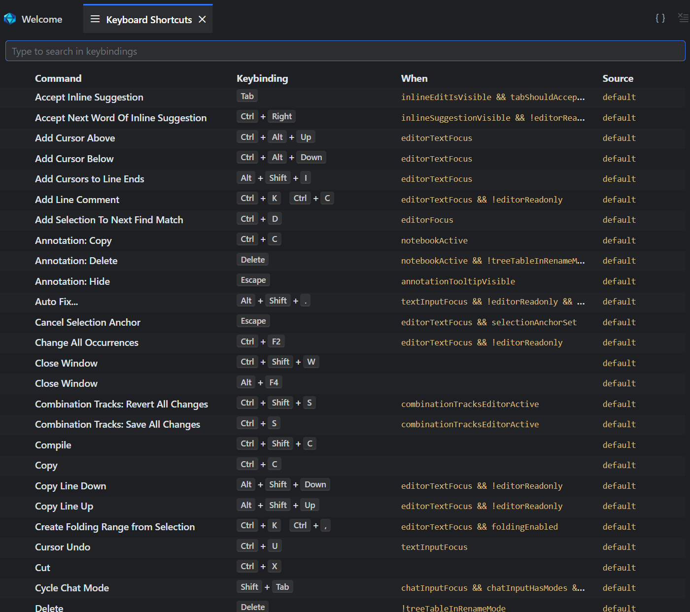