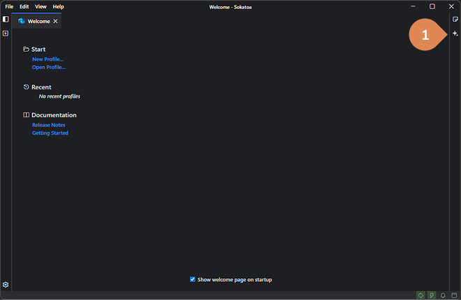
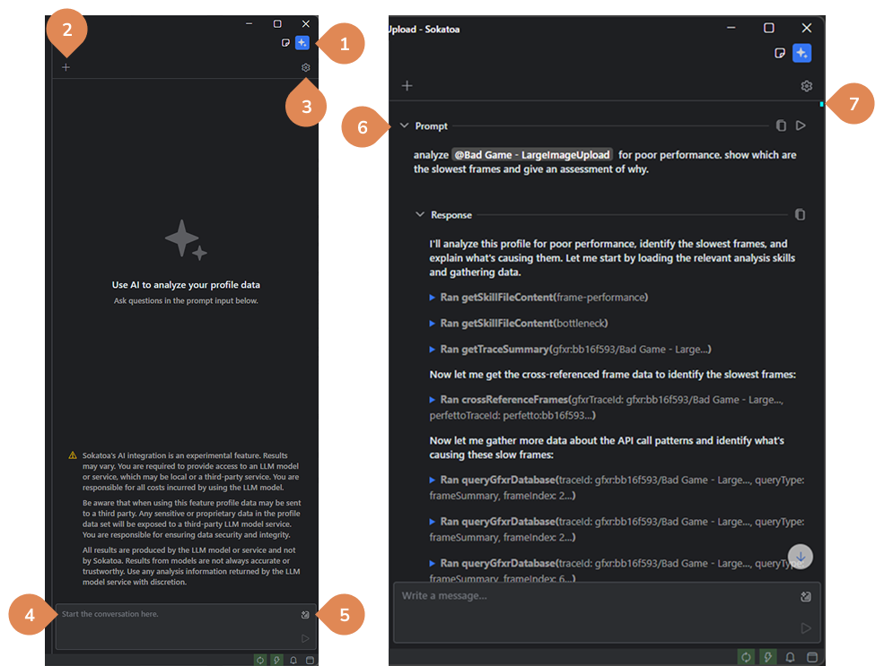
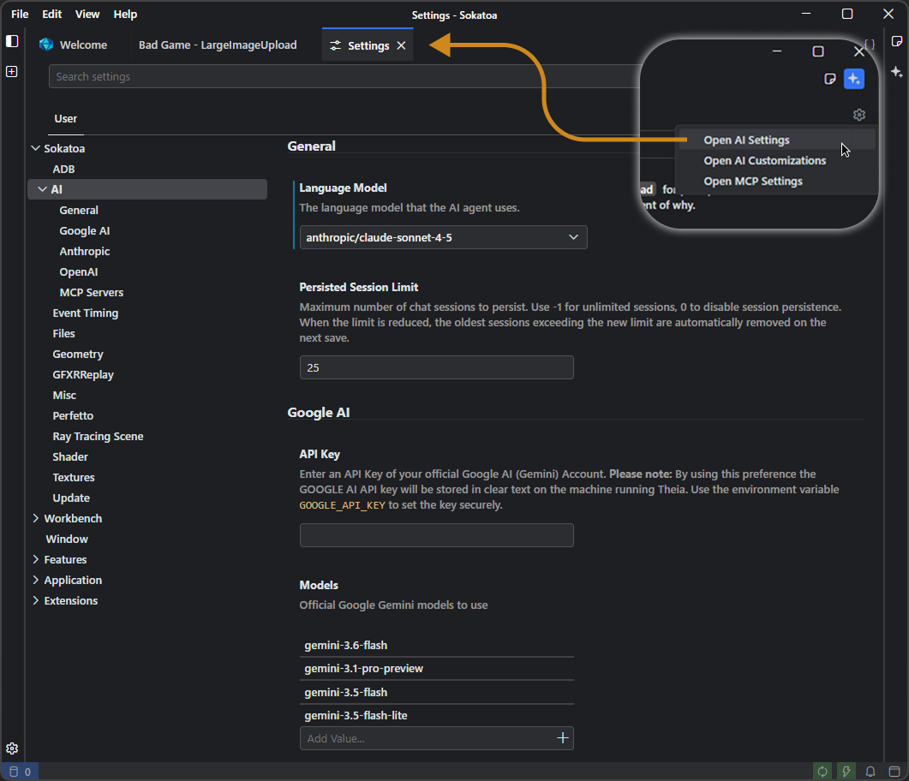
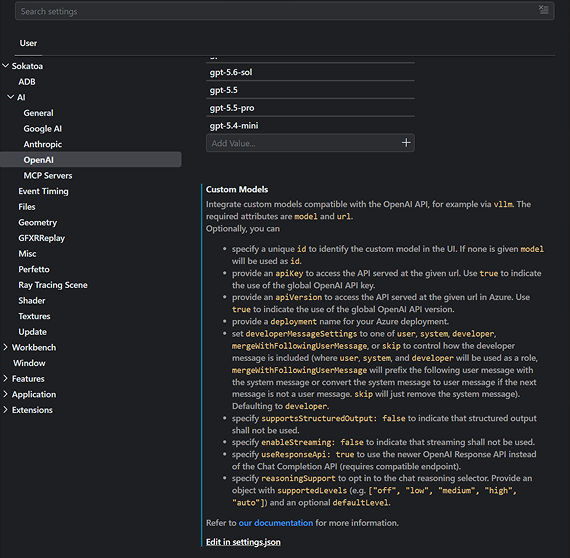
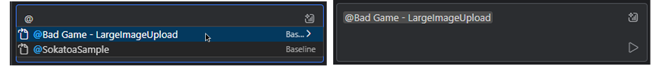
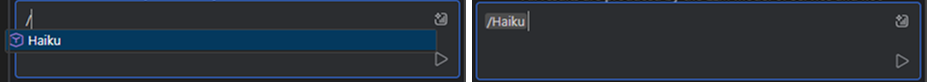
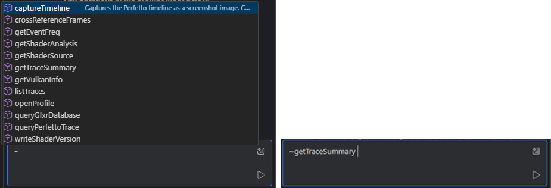
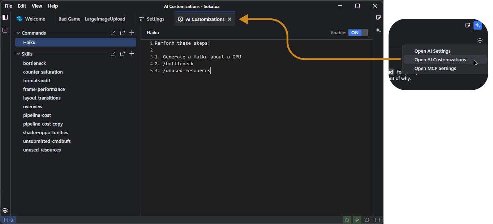
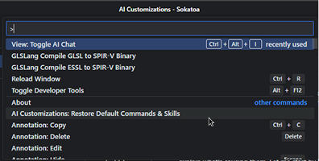

<br>

# AI Analysis with Sokatoa

<br>

- [The Interface](#the-interface)
  - [Chat Panel Anatomy](#chat-panel-anatomy)
- [Settings](#settings)
  - [Custom Models](#custom-models)
  - [Prompt Syntax](#prompt-syntax)
    - [Profiles](#profiles)
    - [Commands](#commands)
    - [Tools](#tools)
  - [Customizations](#customizations)
    - [Commands](#commands-1)
    - [Skills](#skills)
    - [Importing and Exporting](#importing-and-exporting)

<br>
<br>

Sokatoa allows you to leverage the power of AI help analyze and diagnose performance challenges.  It can integrate with popular LLM-based services or local models.  AI helps dramatically reduce the time required to analyze profile data, locate poor performance, determine the cause of the performance issues, and suggest solutions.

Prompts and context can be saved in `commands` and `skills`.  Commands and skills can reference other skills.  Using a prompt syntax you can run `commands` from the prompt and specify any profile in the Profile Explorer.

### Caution
The AI analysis is performed by the model and not Sokatoa.  Sokatoa provides access to profile data and an interface in which to interact with the AI.  LLM-based AI models are an emerging technology, which means their performance and results may vary from model-to-model.  While the results are often profound and amazing, it is important to validate the results of the AI’s analysis.  Results may be inaccurate or untrustworthy.

You are responsible for any account management or costs associated with the use of a third-party service.

Sokatoa shares profile data with the AI.  When using a third-party service data will be shared with that service.  You are responsible for ensuring data security and integrity of any sensitive or proprietary data, which may be shared with a third-party service.

<br>
<br>

# The Interface

AI analysis in Sokatoa happens in the Chat Panel.  The panel is anchored on the right side of the application window.  Click the toggle button to open and close the panel.




### Chat Panel Anatomy

1. **Open/close button:** Open and close the chat panel using the toggle button
2. **New session:** Click to start a new session.  Previous sessions can be restored through the history menu
3. **Settings:** Navigate to the application settings to set API keys, select models, MCP servers and more, or navigate to the customizations view to define commands and skills
4. **Prompt input:** Use the input field to converse with the AI.  See the prompt syntax for useful shortcuts
5. **History:** See and restore past conversations
6. **Prompt container:** Prompts create a container connecting your prompt and the AI’s response.  Exchanges can be expanded or collapsed.   Both the prompt and response text can be copied to the clipboard
7. **Prompt markers:** Markers show the start of an exchange with the AI.  Clicking on a marker scrolls the conversation panel to a prompt, which is convenient when the conversation pane contains many exchanges




<br>
<br>

# Settings

The AI settings is where you configure which third-party LLM service or local model you want to use.  The setup is easy when using Google, Anthropic, or OpenAI.  You simply provide an API key and select your model.  For local models or other third-party services, you directly define the configuration.



<br>

### Custom Models
You can use any third-party service or local model that is OpenAI compatible.  



End points are defined in the `ai-features.openAiCustom.customOpenAiModels`.  The value is an array of model configurations.  The model configuration definition is,

```
{
    model: string,
    url: string,
    id?: string,
    apiKey?: string | true,
    apiVersion?: string | true,
    developerMessageSettings?: 'user' | 'system' | 'developer' | 'mergeWithFollowingUserMessage' | 'skip',
    enableStreaming?: boolean
}
```

An example configuration is,
```
"ai-features.openAiCustom.customOpenAiModels": [    
    {        
        "model": "my-local-model-1-latest",        
        "url": "http://localhost:1234/v1",        
        "id": "Local1",        
        "apiKey": "YourAPIKey",        
        "developerMessageSettings": "system"    
    },    
    {        
        "model": "codestral-latest",        
        "url": "https://codestral.mistral.ai/v1",        
        "id": "Codestral",        
        "apiKey": "YourAPIKey",        
        "developerMessageSettings": "system"    
    }
]
```

<br>
<br>

## Prompt Syntax
There are shortcuts embedded in the prompt input control that allow you to quickly reference a profile, command, or a tool.

#### Profiles 
Use the ```@``` character to activate the profile menu.  This menu shows all profiles listed in the Profile Explorer panel.  Selecting a menu option adds a reference to that profile to the prompt text.



#### Commands
Use the ```/``` character to activate the command menu.  This menu shows all enabled commands.  Selecting a menu option adds a reference to that command to the prompt text.



#### Tools 
Use the ```~``` character to activate the tool menu.  Tools are built-in functions an AI uses to query profile data.  Selecting a menu option adds a reference to that tool to the prompt text.




<br>
<br>

## Customizations

Creating custom prompts and skills leads to better and consistent results.  You can create, import and export custom prompts (commands) and skills from the AI Customizations view.



Sokatoa comes with several skills pre-installed.  You may edit, rename, or delete them.  You can restore these skills from the Command Palette.



#### Commands
Commands are saved prompts.  It is efficient to create commands from frequently used prompts.  You can store domain knowledge, result formatting, or a sequence of steps in the command.  Commands can reference skills (as many as you want), but cannot reference other commands.

Use commands from the prompt input in the chat panel.  By entering a “/” character, a popup will show you all enabled commands.  

#### Skills
Skills are for storing context, domain knowledge, or specialized guides.  Unless specified in a command or a prompt, the AI chooses when to apply a skill based on the context of its work and the context of the skill. 

#### Importing and Exporting
You can export your commands and skills and share them with your team or with others.  Similarly, you can import commands and skills collected from others.