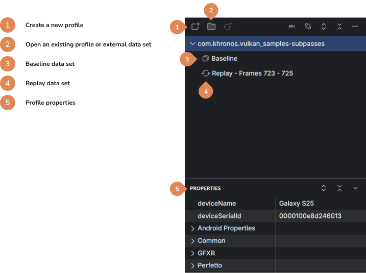
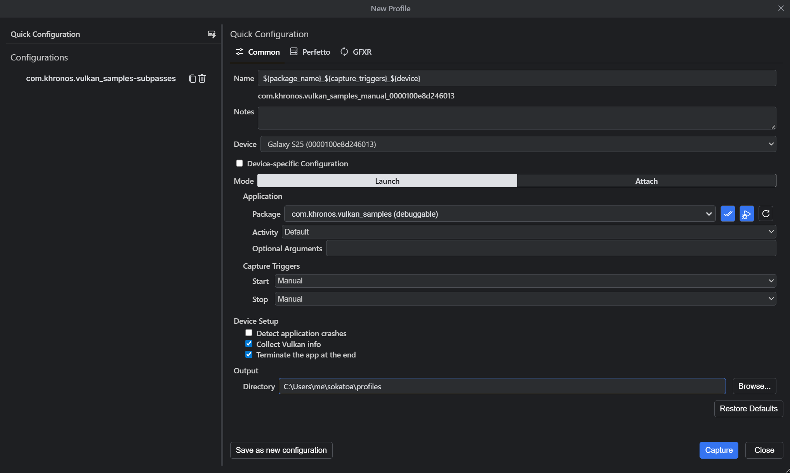
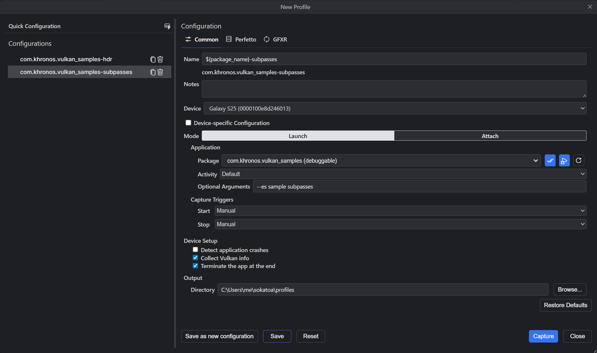
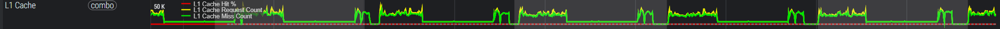
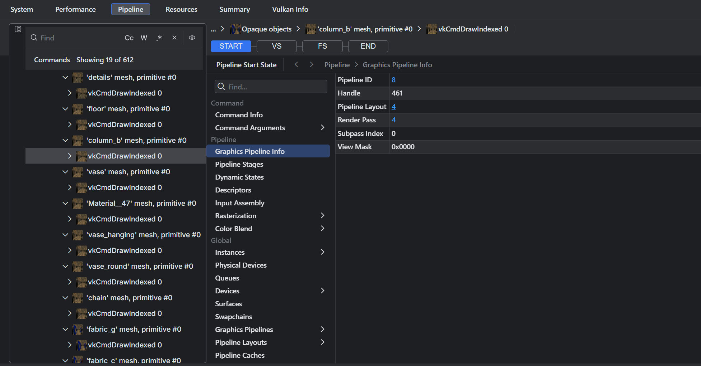
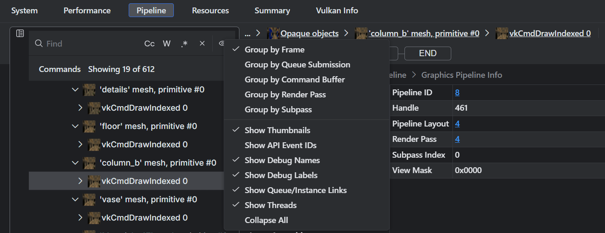
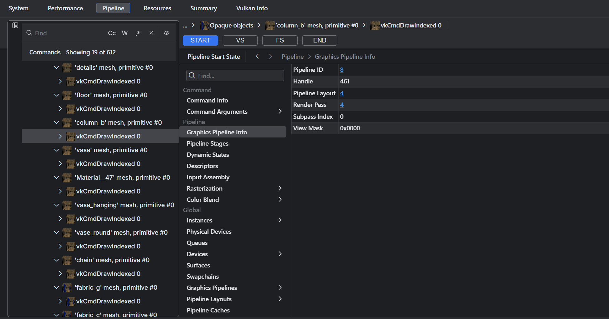
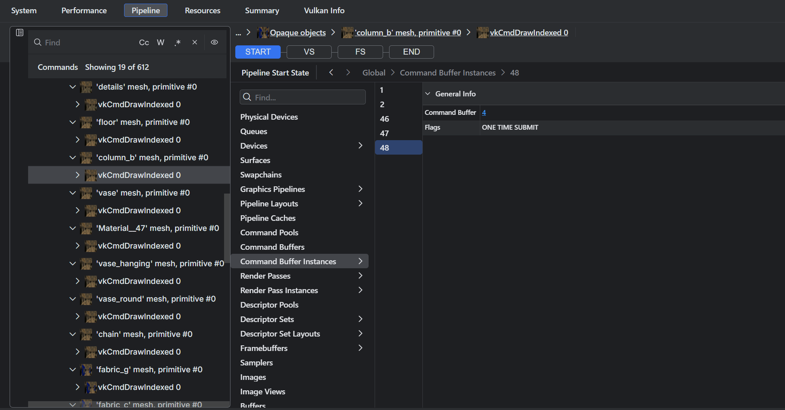
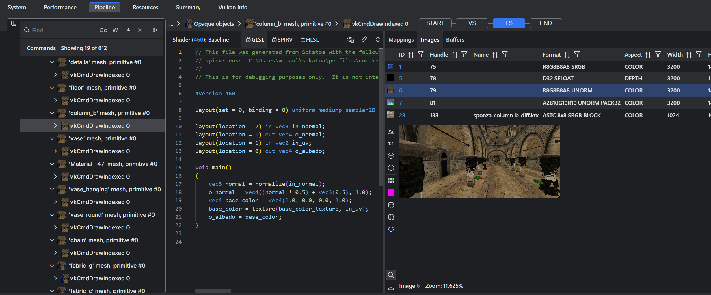
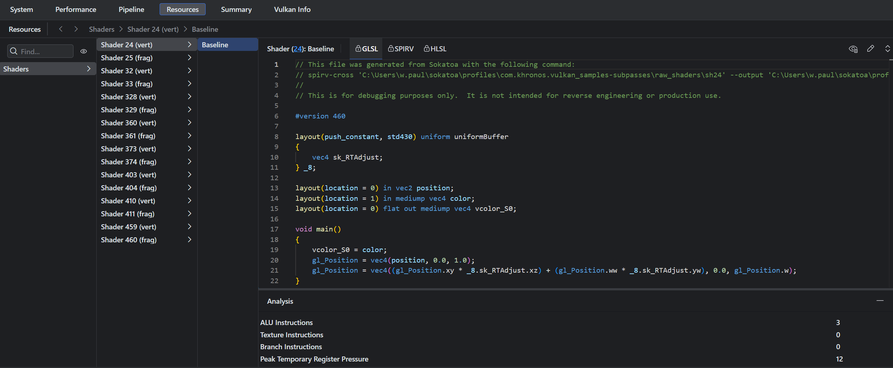

 

# Getting Started with Sokatoa

 

## Introduction

Sokatoa is a tool for profiling and debugging Vulkan graphics rendering for the Android platform.  It was developed to give visibility to both performance metrics and pipeline output across multiple frames in one tool.  Sokatoa is the first tool to do all of this for Android ecosystem developers.  Feature highlights include:

* Multi-frame GPU profiling and debugging
* Deep and broad performance data sets
* Fast iteration of shaders and on-device replay
* Extensibe to enable community and vendor plug-ins

 

## Requirements

-   Host machine
    -   ADB installed and on the path
    -   macOS: macOS 14 or later (Apple silicon)
    -   Linux: Ubuntu 22.04 or later
    -   Windows: Windows 10 or later
    -   Device connected to ADB (USB or Wi-Fi) - requires developer mode and USB debugging enabled for USB connection.
-   Android device
    -   Android 13 or later
    -   Debuggable APK or rooted device required for GFXR, Sokatoa Vulkan layers
    -   For performance view data, Xclipse, Mali, Adreno or PowerVR GPU required
 
 

## Creating and viewing your first profile

A *profile* is the central container for all performance or debugging data collected from an application.  Perfetto and GFXR are the primary data generators, but plug-ins can also augment the profile data set.

There are two ways to create a profile.  The first is to initiate a capture from Sokatoa, and the second is to import Perfetto or GFXR files.  The initial data set is called the *baseline*.  During your analysis workflow you might make changes and create subsequent captures.  These are called *replays*.  You may also create a *slice* by selecting a subset of a capture data set and saving it as a separate data set.  For example, if your baseline spans 20 frames, you might create a slice to focus on only a few frames of interest.

The Profile Explorer panel shows a list of profiles.  Double clicking on a capture node opens that profile in a new tab.  The capture properties are shown in the Profile Properties pane below the profile tree.  From here you can see meta data such as settings used at capture time, and various Android properties.

You can create a new profile by selecting the New Profile... option from the file menu, or by using the toolbar in the profile explorer. This opens the new profile dialog where you can specify capture options and start the capture process.  
 

### New Profile Configuration
Capturing profile data starts by configuring what data you want to collect.  From here you define which data producers will contribute to the profile and what data elements you want.  

Quick configuration is the default behavior. You can change any of the capture settings. You can save your configuration settings by clicking the save as new configuration button. This can be useful when you need to make multiple captures, whether they are of different apps, or the same app with different command line arguments, or perhaps different Perfetto options. Saved configurations are listed on the left.

After you click create, the capture process starts.  When completed the new profile is added to the Profile Explorer and opened in a new tab.

 

### Viewing a profile

Profiles can be viewed from several different perspectives.  The primary views are System, Performance, Pipeline, and Resources.  There is also a timeline component anchored to the bottom.

#### The timeline

The timeline component shows both the overall profile timeline and the current selected range. When the profile contains GFXR data you will see the frame thumbnails. You can drag either side of the range selector to update the current range. When the mouse hovers over the range selector the mouse wheel causes the range to zoom in and out. You can also drag the range selector to pan left or right.

Hovering over a frame shows a larger frame thumbnail, other frame details and actions to perform on the frame. For example, you can replay a frame to collect additional data or to remeasure frame performance.

#### System

The System view presents the profile's Perfetto data in a standard Perfetto view.  By default, a user-editable Perfetto workspace named "Sokatoa" is created with some of the more interesting data tracks collected at the top and all tracks accessible in a group named "All Tracks".

You can use ctrl + mouse wheel to zoom in or out and shift + click/drag to pan left or right. You can also use WASD keys for navigation (W/S for vertical, A/D for horizontal). For the full set of Perfetto interactions, see the **Show Timeline Keyboard Shortcuts** option in the **Help** application menu.

Using the Perfetto Workspace Templates editor, you can define custom templates for Perfetto workspaces and decide which ones, if any, are instantiated by default in new profiles.

Each track has a toolbar which lets you do things like select, remove, pin, rename or pin the track, view the track details, or copy it to a new or existing workspace.  You can quickly add or remove tracks in the pinned tracks group using the pin icon in the track name column. You can also quickly remove any tracks you're not interested in by clicking on the hide track icon.

Click the **Create combined tracks** icon button in the top right to open the Combination Tracks configuration tab.  The combine tracks tab lets you combine certain tracks together into the same track. This can be interesting for things like related performance counters for example. You can create profile-specific or global combination tracks.

#### Performance

This profile view displays performance metrics relative to frames, command buffers, renderpasses or subpasses. This includes the duration of each, as well as a summary of performance counter activity at that time. You can sort the columns to locate your most expensive areas. You can also right-click on any column to access a context menu where you can remove or sort the column, or open a dialog that lets you choose which columns to display.

The command tree is generated from GFXR data and the metrics are calculated from the Perfetto data such as performance counters and track data from the render stages. These come from the Vulkan driver and are GPU specific. The content depth and quality vary depending on hardware platform. Many devices only provide performance metrics down to the command buffer level. Other devices may provide additional information down to the render pass or sub-pass level.

#### Pipeline

This view presents the captured Vulkan commands and related pipeline data. The command tree shows the Vulkan commands grouped by frame, by default, but there are other ordering and grouping options.

To the right of the command tree are the pipeline details for the selected command. This includes both the start and end state as well as any shader stages.

##### Start Stage

The start stage displays various state data about the selected command in three sections. The first is the command section which contains command properties and arguments. 

The start stage may display information about the actively bound pipeline of the currently selected command. This is based on what command is selected in the command tree and is only relevant for draw or dispatch command types. Unlike other graphical debuggers, Sokatoa has chosen to collapse the fixed function pipeline stages into the start stage of the pipeline view. You can find that information in the pipeline section. For example, graphics pipelines will display the Input Assembly, Rasterization, and Color Blend stage information under this pipeline section in addition to the information of the pipeline itself and its configured dynamic state.

The start stage also displays a filtered view of the Vulkan object state at the time of the submission ordering event associated with the currently selected command. Commands within a command buffer were executed at an earlier time during command buffer recording, thus their initial execution time is not used as it is not the same as when it was submitted to the queue for processing on the GPU. Using the start of frame or queue submission as our point of reference for filtering is what we call "Submission ordering" of the commands as opposed to "Execution ordering" where the commands would be shown in the order they were executed by the Vulkan app. In submission ordering, the selected command's Queue Submit event is the most relevant point to filter the global state of the Vulkan objects.

##### Shader Stages

Selecting a shader stage shows the shader code and any relevant attributes or descriptors. When appropriate, geometry or images are accessible for viewing. Linked buffer view can be inspected as raw hex data.

### Resources

This view currently only shows shaders used in the profile. The SPIR-V binaries captured by GFXR are disassembled and cross-compiled into higher level shader languages. Disassemble and cross-compilation settings can be found under the Sokatoa -> Shader -> Disassemble section of the settings panel.

### Summary

This view gives you a quick summary of the profile, including things like average FPS, average frame duration, etc. The summary is filtered to the zoom level of the profile like the other views.

 

## Next steps

Feel free to dive in and use Sokatoa.  [There is additional getting started documentation available if you want to read more.](./after-getting-started.md)