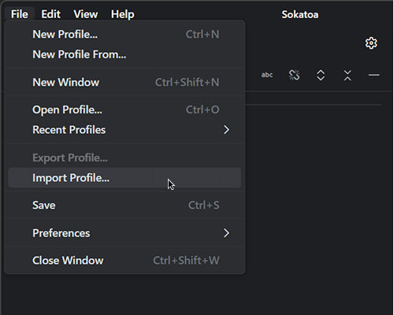

 

# Getting Started with Sokatoa

 

## Introduction

Sokatoa is a tool for profiling and debugging Vulkan graphics rendering for the Android platform.  It was developed to give visibility to both performance metrics and pipeline output across multiple frames in one tool.  Sokatoa is the first tool to do all of this for Android ecosystem developers.  Feature highlights include:

* Multi-frame GPU profiling and debugging
* Deep and broad performance data sets
* Fast iteration of shaders and on-device replay
* Extensible to enable community and vendor plug-ins

 

## Requirements

-   Host machine
    -   ADB installed and accessible from the `PATH` environment variable
    -   macOS: macOS 14 or later (Apple silicon)
    -   Linux: Ubuntu 22.04 or later
    -   Windows: Windows 10 or later
    -   Device connected to ADB (USB or Wi-Fi) - requires developer mode and USB debugging enabled for USB connection.
-   Android device
    -   Android 13 or later
    -   Debuggable APK or rooted device required for GFXR, Sokatoa Vulkan layers
    -   For performance view data, Xclipse, Mali, Adreno, or PowerVR GPU required
 
 

## Exploring the sample profile
1. [Download the sample profile archive.](https://github.com/sarc-acl/sokatoa/releases/latest/download/SokatoaSample.spa)
2. Import the profile archive
   
   The easiest way to import a profile archive is to double-click the file from your system's file viewer (e.g., Windows Explorer).  Alternatively, you can select the 'Import Profile...' option from the 'File' menu.

    

    When the import process completes, click the 'Open' button from the dialog to open and view the imported profile.

    

3. Sokatoa will present the profile in the System view. At this point, you are free to explore the tool.  
    See the [View the profile](./viewing-profiles.md) documentation for other areas of interest.

 
 

## Next steps

Feel free to dive in and use Sokatoa.  You can also learn more about,

* [Profiles](./profiles.md)
* [Analyzing profile data](./viewing-profiles.md)
* [AI analysis](./ai-analysis.md)
* [Notes and annotations](./notes.md)
* [Shader editing](./shaders.md)