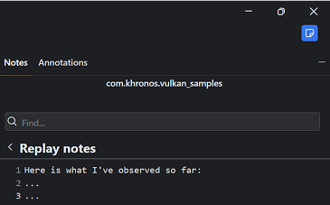
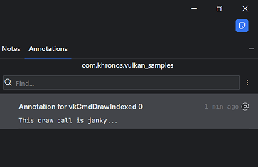
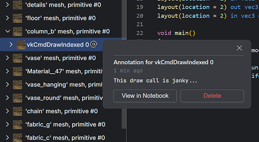

 

# The Notebook

- [Notes](#notes)
- [Annotations](#annotations)

 
 

The notebook view contains notes and annotations about the selected profile. The notebook is stored with the profile and can therefore be shared.

## Notes

Notes taken when creating a profile or replay are shown here. You can also add more as you investigate the profile.

## Annotations

Annotations are notes that are attached to some UI element in the profile. Currently, you can only create annotations on command tree nodes, but we will extend that in the future. You can create an annotation from the context menu.

