 

# Getting to Know Profiles

 

- [Creating and viewing your first profile](#creating-and-viewing-your-first-profile)
- [New Profile Configuration Basics](#new-profile-configuration-basics)
- [Profile Configuration Details](#profile-configuration-details)
  - [Common](#common)
    - [New Profile Name Variables](#new-profile-name-variables)
  - [Perfetto](#perfetto)
  - [GFXR](#gfxr)
- [Export a Profile](#export-a-profile)
- [Import a Profile](#import-a-profile)
  - [Quick Profile Importing](#quick-profile-importing)
- [Replays](#replays)
- [Comparing Captures](#comparing-captures)

 
 

A **profile** is the central container for all performance or debugging data collected from an application.  Perfetto and GFXR are the primary data generators, but plug-ins can also augment the profile data set.

The process of collecting data for a profile is called 'capturing'.  A profile consists of one or more **captures**.  There are two primary types of captures: a **baseline** and **replays**.  The first capture is the baseline and any subsequent captures are called replays.

During your analysis workflow you might make changes to shaders or want to collect different data. These are called **replays**.

You may also create a **slice** by selecting a subset of a capture data set and saving it as a separate data set.  For example, if your baseline spans 20 frames, you might create a slice to focus on only a few frames of interest.

 

## Creating and viewing your first profile

1. Click the 'New Profile...' icon button.
 
   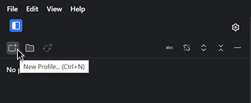

2. Define the [profile configuration](#new-profile-configuration-basics).
3. Press the 'Capture' button from the 'New Profile Dialog'

After the capture process completes, you will see the new profile in the **Profile Explorer**

The Profile Explorer panel shows a list of profiles.  Double clicking on a capture node opens that profile in a new tab.  The capture properties are shown in the Profile Properties pane below the profile tree.  From here you can see metadata such as settings used at capture time, and various Android properties.

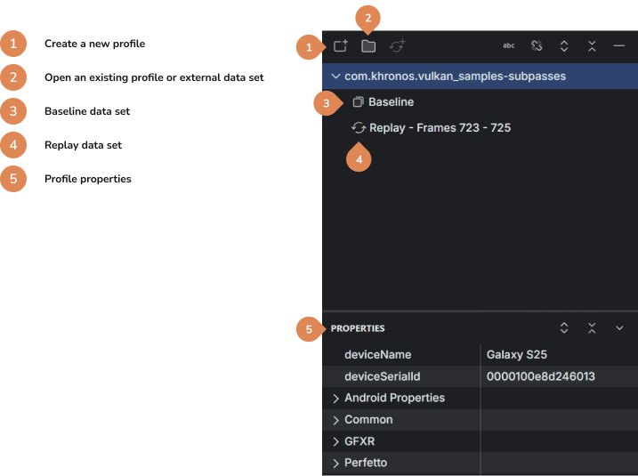

Learn more about [viewing profile data.](./viewing-profiles.md)

 
 

## New Profile Configuration Basics
Capturing profile data starts by configuring what data you want to collect.  From here you define which data producers will contribute to the profile and what data elements you want.  

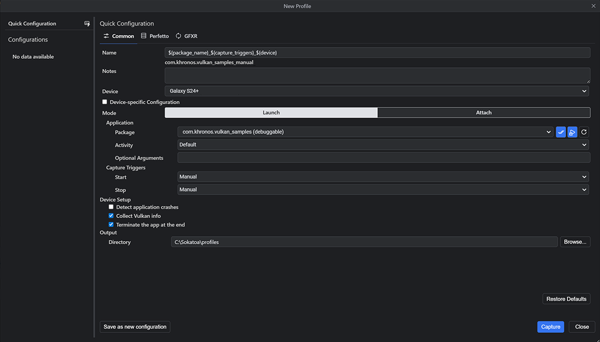

Quick configuration is the default behavior. You can change any of the capture settings. You can save your configuration settings by clicking the save as new configuration button. This can be useful when you need to make multiple captures, whether they are of different apps, or the same app with different command line arguments, or perhaps different Perfetto options. Saved configurations are listed on the left.

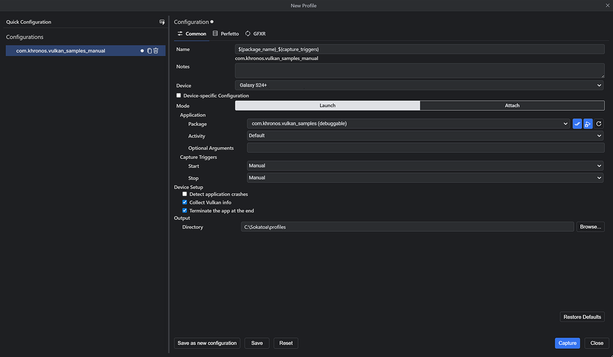

After you click create, the capture process starts.  When completed the new profile is added to the Profile Explorer and opened in a new tab.

 
 

## Profile Configuration Details
#### Common

This tab contains the common capture options.

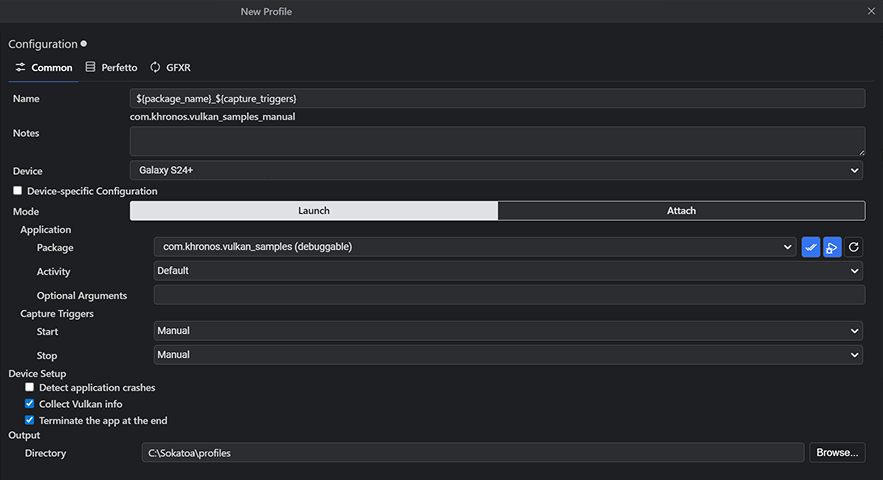

-   **Name**: The name of the profile to create. This is the name that will be shown in the profile explorer and the name of the profile directory. The default is a variable expression `${package_name}_${capture_triggers}_${device}`, which will use the name of the selected package, the capture triggers, and device ID. See below for a list of the available variables in the different contexts for new captures.
-   **Notes**: You can optionally add notes here which will be added to the profile's notebook.
-   **Device**: Select the device you wish to capture from. This uses ADB to get the list of connected devices.
-   **Device-specific Configuration**: Check this when the configuration is specific to the currently connected device. Doing so will prevent the device selector from automatically selecting another connected device when this device is not connected.
-   **Mode**:
    -   **Launch**: Launch the selected package/activity on the device with the given arguments.
    -   **Attach**: Just attach to the device and capture without launching a package/activity. NOTE: GFXR capture requires starting a package/activity as the Vulkan API is tracked from application start. Therefore, you can only capture Perfetto data in this mode.
-   **Capture Triggers**:
    -   **Start**:
        -   **Manual**: The capture will start when you press the start button on the capture progress dialog.
        -   **Delay since app launch**: The capture will start in the given number of milliseconds after the application was started.
        -   **Frame (inclusive)**: The capture will start when the given frame is rendered. Frame numbers start at 1.
    -   **Stop**:
        -   **Manual**: The capture will stop when you press the stop button on the capture progress dialog.
        -   **Duration since capture start**: The capture will stop in the given number of milliseconds after the capture was started.
        -   **Frame (inclusive)**: The capture will stop after the given frame is rendered.
-   **Device Setup**:
    -   **Detect application crashes**: When enabled, application crashes are detected using 'am monitor' and the crash details will be saved as a file in the created profile.
    -   **Collect Vulkan info**: When enabled, Vulkan information will be retrieved from the device using feature enumeration and displayed in the Vulkan Info tab in the capture view.
    -   **Terminate the app at the end**: When enabled, the app will be terminated at the end of the capture.
-   **Output Directory**: The location on disk at which to create the profile.

##### New Profile Name Variables

| Variable Name    | New Profile | New Replay | Arguments | Description                                                                                                                                                                              |
| ---------------- | ----------- | ---------- | --------- | ---------------------------------------------------------------------------------------------------------------------------------------------------------------------------------------- |
| activity         | ✔️          |            | N/A       | The name of the activity that is launched, or "Default" for the package's default activity.                                                                                              |
| capture_triggers | ✔️          | ✔️         | N/A       | A précis of the capture triggers, e.g., "manual", "frames_1000-1050", or "from_1000ms_to_1500ms"                                                                                          |
| device           | ✔️          | ✔️         |           | Information about the device on which the capture is performed, selected by the argument. Without any argument, expands to the device identifier, e.g., `${device}` for "21231JEGR02186". |
|                  |             |            | id        | The device identifier, e.g., `${device:id}` for "21231JEGR02186".                                                                                                                         |
|                  |             |            | name      | The device name, e.g., `${device:name}` for "My Pixel 6a".                                                                                                                                |
| mode             | ✔️          |            | N/A       | The capture mode, either "launch" or "attach".                                                                                                                                           |
| package_name     | ✔️          |            | N/A       | The name of the selected package. Replays always use the replay application.                                                                                                             |
| timestamp        | ✔️          | ✔️         |           | The date and time when the capturing process was initiated, in YYYYMMDDHHmmss format, e.g., 20250312112100.                                                                               |
|                  |             |            | -         | The timestamp in hyphenated format, e.g., 2025-03-12_11-21-00                                                                                                                             |
|                  |             |            | iso       | The timestamp in ISO 8601 format, e.g., 2025-03-12T11:21:00.523Z                                                                                                                          |
|                  |             |            | locale    | The timestamp in JavaScript locale-specific format, e.g., 3/12/2025, 11:21:00 AM                                                                                                          |
|                  |             |            | utc       | The timestamp in JavaScript UTC format, e.g., Wed, 12 Mar 2025 15:21:00 GMT                                                                                                               |

#### Perfetto

This tab contains the Perfetto capture options.

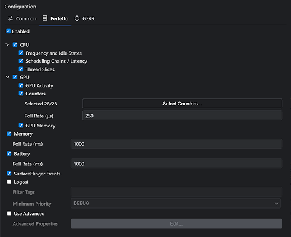

-   **Enabled**: When enabled, Perfetto data will be captured. This will enable the system view of the profile which contains data from both the CPU and GPU.

Perfetto capture adds some overhead, but it's minor.

The default values for the rest of the settings should be fine for most users. You can uncheck certain types of data that you're not interested in. You can select which performance counters to collect. Advanced users can edit the Perfetto configuration directly. See <https://perfetto.dev/docs/concepts/config> for more information.

#### GFXR

This tab contains the GFXR capture options.

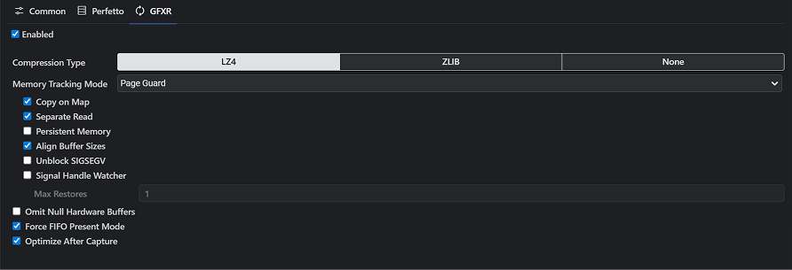

-   **Enabled**: When enabled, GFXR data will be captured. This will enable the performance, pipeline and resources views of the profile. It also enables fetching screenshots, images, meshes, and other data for certain events, and allows replaying with shader replacement. NOTE: As GFXR requires the use of a Vulkan validation layer, the target APK must be debuggable or the device must be rooted.

GFXR capture can add significant overhead (~30%). We are working to reduce that overhead, but it will never be negligible as it must record all Vulkan API calls and data in order to support replay. Keep this in mind when looking for performance issues. It is recommended to perform an initial baseline capture that includes GFXR and then perform a replay of the captured baseline to evaluate graphics performance as replays do not include the GFXR overhead experienced during baseline capture. Alternatively, you may want to capture Perfetto only for system level performance analysis.

The default values for the rest of the settings should be fine for most users. For more information on the GFXR settings, please see <https://github.com/LunarG/gfxreconstruct/blob/dev/USAGE_android.md>.

If your app installs its own signal handlers, or you use a third-party crash reporter SDK, they may conflict with GFXR's memory tracking modes, Page Guard and User Fault FD.

 
 

## Export a Profile
It is common to share or archive profiles.  Sokatoa profiles can be imported and exported making it convenient to manage profiles.  The export process creates a Sokatoa Profile Archive (.spa) file.

To export a profile, right-click on the profile you wish to export.  From this context menu, select the `Export` option.

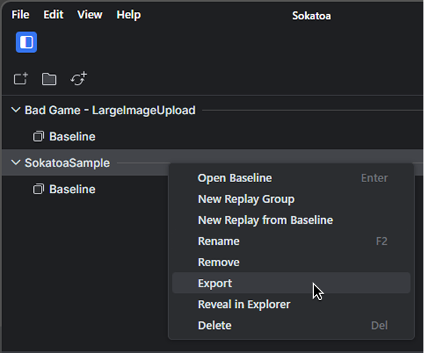

This opens a dialog for you to select a destination and have the option to rename the profile archive.  Clicking the `Export` button starts the archival process.

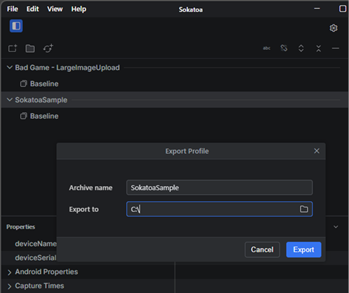

 
 

## Import a Profile
To import a profile archive, open the ‘File’ menu and select the ‘Import’ option.  A system file picker opens.  Use this to select the Sokatoa profile archive (spa) file you wish to import. From here, Sokatoa will import the profile archive into the profile repository directory.

After the import process completes, you have the option to add the profile to the Profile Explorer or open to profile for viewing.

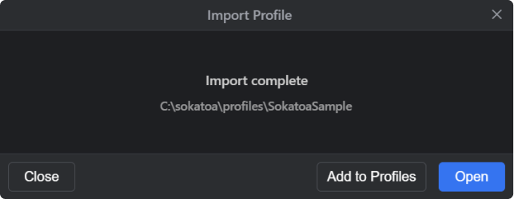

#### Quick Profile Importing
There are two other options for importing profile archives.  From the system’s file system viewer (e.g., Windows File Explorer), you can double-click the archive file.  This triggers the import process.

The other option is to drag the archive file onto the Sokatoa window.

 
 

## Replays

A replay uses GFXR to replay the profile on the device. This allows the tool to capture new Perfetto data and new screenshots. You can replay the entire baseline, a slice, or one or more selected frames. If you have modified one or more shaders, you can choose which modified shaders to use during the replay. This allows you to see differences in both rendering and in performance.

Note that GFXR replays start from the beginning of the capture regardless of which replay region is selected. For long captures you may notice some activity before the replay region is shown on the device. Data is only collected for the replay region and the replay timeline will be limited to the region selected.

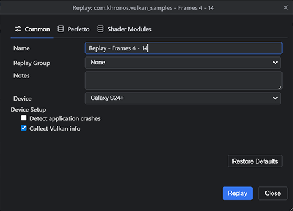

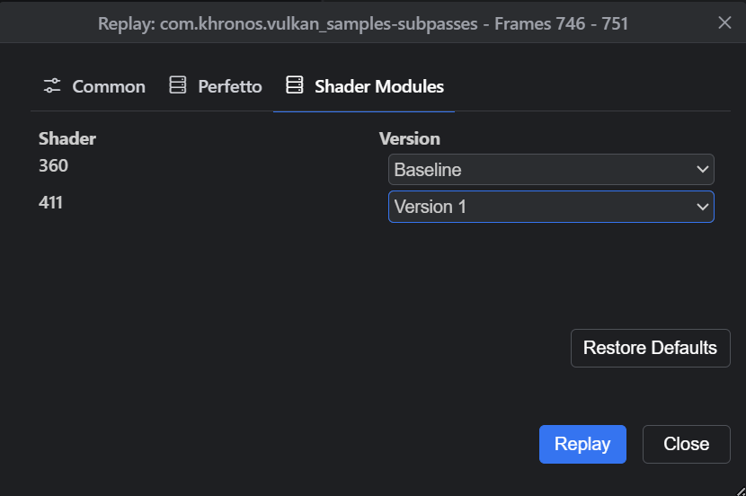

 
 

## Comparing Captures

You can compare the baseline with a replay or a replay with a replay. Simply select the two nodes in the profile explorer that you want to compare, right-click and select compare.

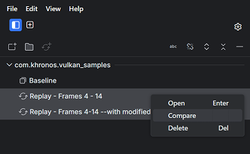

The two timelines are automatically synced and remain in sync as you zoom and pan. Depending on the shader changes, you may see visual differences in the frames or changes in frame performance.

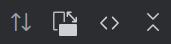

The comparison toolbar provides some functions in addition to the normal timeline toolbar. The first button allows you to switch the order of the comparison views. This will also switch the order of the stacked timelines. The second button allows you to flip the orientation of the comparison from horizontal to vertical. The last two buttons are the same as the timeline toolbar.
