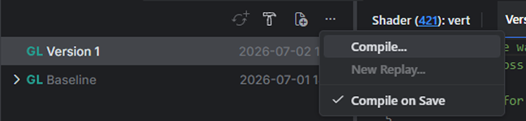
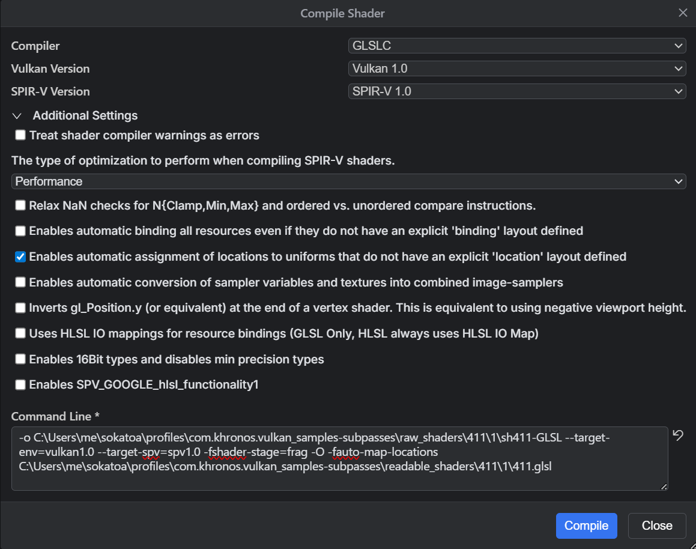
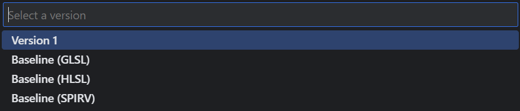

<br>

# Shaders

<br>

- [Overview](#overview)
- [Shader Editing](#shader-editing)
  

<br>
<br>

## Overview
The shader view shows disassembled and cross-compiled shaders. Note that this is not the original shader code used by the application, but a best guess based on the binary SPIR-V captured by GFXR. Disassemble and cross-compilation settings can be found in the settings panel under the ```Sokatoa -> Shader``` section.

<br>

## Shader Editing
To edit the shader for shader replacement during replay, select the tab of the shader language you would like to edit first, and then click on the edit icon at the top right. This will open an editor for that shader with a new version created for you. It's named **Version 1** by default, but you can rename it to whatever you like.

<br>


<br>

Edit the shader and save using Ctrl+S. This will trigger automatic shader compilation back to SPIR-V. The result will appear in the notifications area. The version entry in the table will also turn green when compilation was successful and red when it fails. By default, Sokatoa will use glslc or dxc compilers to compile the shader depending on the high-level language. glslang is also a supported shader compiler. Shader compiler settings can be found in the ```Sokatoa -> Shader``` section of the settings panel. You can also use the hamburger menu to open the compile dialog where you can customize the compiler settings.

<br>





You can create as many versions as you wish. To create a new version, click the new version icon and select the source of the new version.



You can also create a new version with the real shader source if you have it by clicking on the new version icon and selecting from file.
