<br>

# Viewing a profile

<br>

- [The timeline](#the-timeline)
- [System](#system)
- [Performance](#performance)
- [Pipeline](#pipeline)
    - [Start Stage](#start-stage)
    - [Shader Stages](#shader-stages)
- [Resources](#resources)
- [Summary](#summary)
- [Vulkan information](#vulkan-information)
- [Status Bar](#status-bar)


<br>
<br>

Profiles can be viewed from several different perspectives.  The primary views are System, Performance, Pipeline, and Resources.  There is also a timeline component anchored to the bottom.

## The Timeline

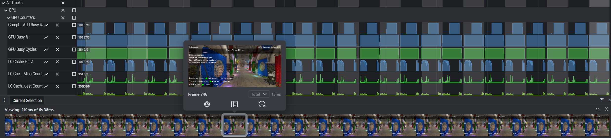

The timeline component shows both the overall profile timeline and the current selected range. When the profile contains GFXR data you will see the frame thumbnails. You can drag either side of the range selector to update the current range. When the mouse hovers over the range selector the mouse wheel causes the range to zoom in and out. You can also drag the range selector to pan left or right.

Hovering over a frame shows a larger frame thumbnail, other frame details and actions to perform on the frame. For example, you can replay a frame to collect additional data or to remeasure frame performance.

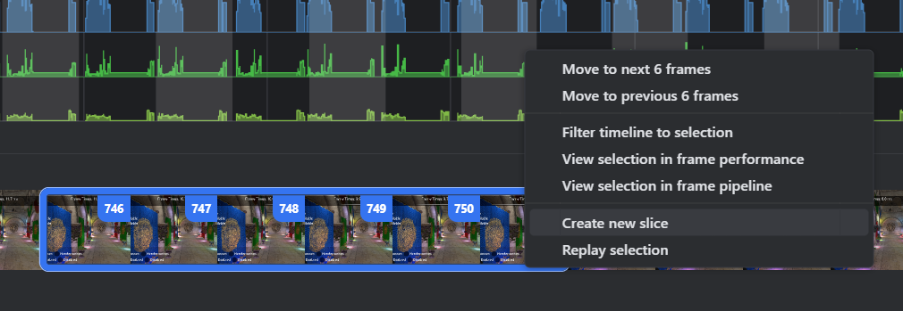

You can create a slice by drag-selecting or shift-clicking frames and then right-clicking and selecting "Create New Slice". A slice is just a new view of the data that's filtered to a specific frame range. Both Perfetto and GFXR data will be filtered to the slice's configured frame range. You can select slices from the timeline toolbar.


Double clicking on a frame thumbnail will zoom the timeline to that frame. Right clicking on the thumbnail provides additional navigation, slice and replay functionality.


The timeline toolbar provides some buttons for useful features. The first button is the previously mentioned slice selector. Select None to show the entire timeline, or select a slice to filter the view to that range of frames. The second button will re-expand the timeline to the full length of the capture, or of the slice if one is applied. This makes it easy to quickly zoom out to see the full timeline. The third button hides/shows the frame thumbnails section of the timeline, providing additional vertical space to see the other views.

<br>
<br>

## System

The System view presents the profile's Perfetto data in a standard Perfetto view.  By default, a user-editable Perfetto workspace named "Sokatoa" is created with some of the more interesting data tracks collected at the top and all tracks accessible in a group named "All Tracks".

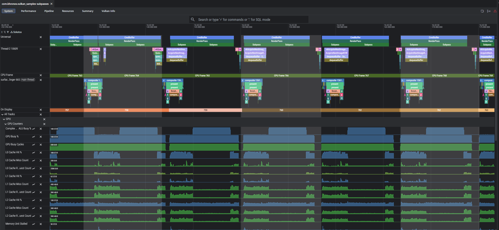

You can use ctrl + mouse wheel to zoom in or out and shift + click/drag to pan left or right. You can also use WASD keys for navigation (W/S for vertical, A/D for horizontal). For the full set of Perfetto interactions, see the question mark icon at the top right of the view.

Using the Perfetto Workspace Templates editor, you can define custom templates for Perfetto workspaces and decide which ones, if any, are instantiated by default in new profiles.

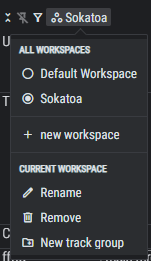

Each track has a toolbar which lets you do things like select, remove, pin, rename, or unpin the track, view the track details, or copy it to a new or existing workspace.  You can quickly add or remove tracks in the pinned tracks group using the pin icon in the track name column. You can also quickly remove any tracks you're not interested in by clicking on the hide track icon.

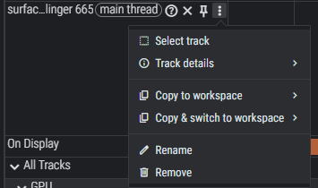

Click the **Create combined tracks** icon button in the top right to open the Combination Tracks configuration tab.  The tab lets you combine certain tracks together into the same track. This can be interesting for things like related performance counters for example. You can create profile-specific or global combination tracks.

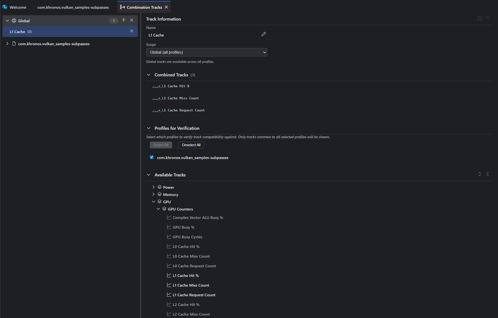


<br>
<br>


## Performance

This profile view displays performance metrics relative to frames, command buffers, render-passes or sub-passes. This includes the duration of each, as well as a summary of performance counter activity at that time. You can sort the columns to locate your most expensive areas. You can also right-click on any column to access a context menu where you can remove or sort the column, or open a dialog that lets you choose which columns to display.

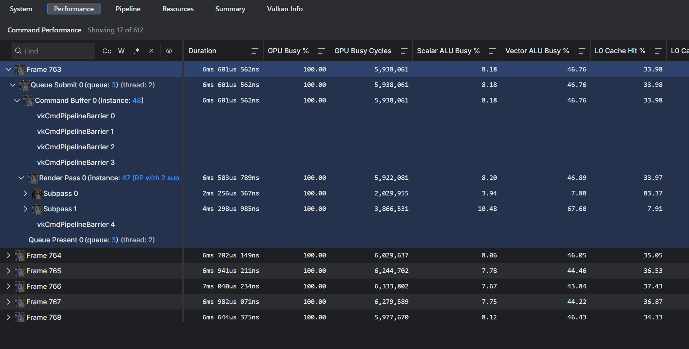

The command tree is generated from GFXR data and the metrics are calculated from the Perfetto data such as performance counters and track data from the render stages. These come from the Vulkan driver and are GPU specific. The content depth and quality vary depending on the hardware platform. Many devices only provide performance metrics down to the command buffer level. Other devices may provide additional information down to the render-pass or sub-pass level.

<br>
<br>

## Pipeline

This view presents the captured Vulkan commands and related pipeline data. The command tree shows the Vulkan commands grouped by frame, by default, but there are other ordering and grouping options.

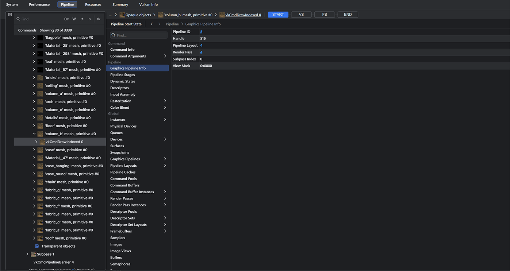


To the right of the command tree are the pipeline details for the selected command. This includes both the start and end state as well as any shader stages.

### Start Stage

The start stage displays various state data about the selected command in three sections. The first is the command section which contains command properties and arguments. 

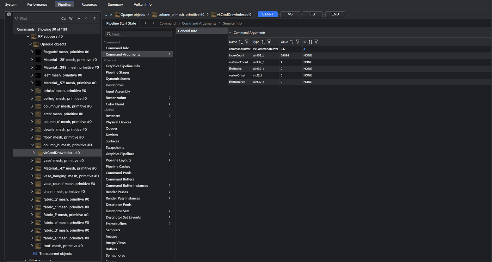

The start stage may display information about the actively bound pipeline of the currently selected command. This is based on what command is selected in the command tree and is only relevant for draw or dispatch command types. Unlike other graphical debuggers, Sokatoa has chosen to collapse the fixed-function pipeline stages into the start stage of the pipeline view. You can find that information in the pipeline section. For example, graphics pipelines will display the Input Assembly, Rasterization, and Color Blend stage information under this pipeline section in addition to the pipeline's own information and its configured dynamic state.

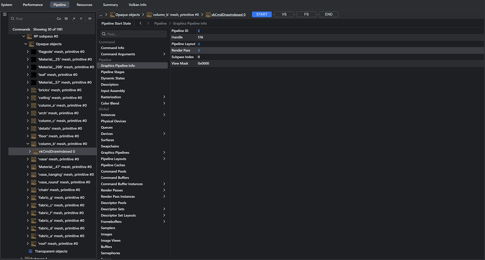

The start stage also displays a filtered view of the Vulkan object state at the time of the submission ordering event associated with the currently selected command. Commands within a command buffer were executed at an earlier time during command buffer recording, thus their initial execution time is not used as the time is not the same as when it was submitted to the queue for processing on the GPU. Using the start of frame or queue submission as our point of reference for filtering is what we call "Submission ordering" of the commands as opposed to "Execution ordering" where the commands would be shown in the order they were executed by the Vulkan app. In submission ordering, the selected command's Queue Submit event is the most relevant point to filter the global state of the Vulkan objects.


### Shader Stages

Selecting a shader stage shows the shader code and any relevant attributes or descriptors. When appropriate, geometry or images are accessible for viewing. The linked buffer view is inspectable as raw hex data.  More information on working with shaders is available on the [shader documentation](./shaders.md#overview).

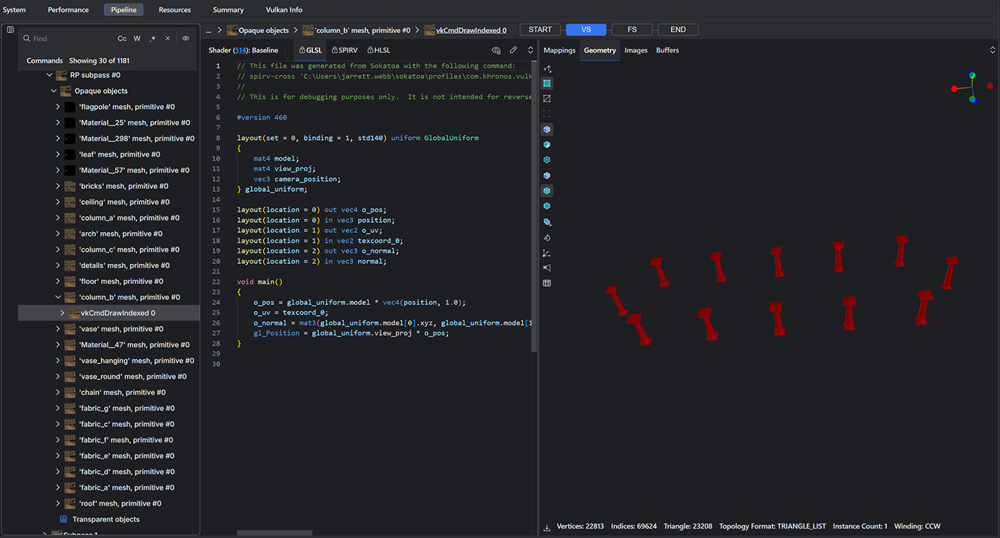

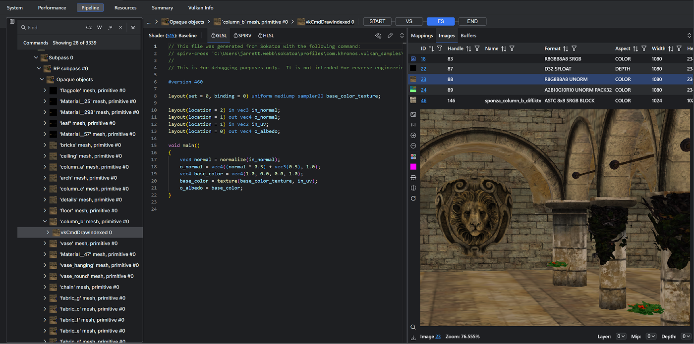


<br>
<br>


## Resources

This view shows shaders used in the profile. The SPIR-V binaries captured by GFXR are disassembled and cross-compiled into higher-level shader languages. Disassemble and cross-compilation settings can be found under the ```Sokatoa -> Shader``` section of the settings panel.


<br>
<br>


## Summary

This view gives you a quick summary of the profile, including things like average FPS, average frame duration, etc. The summary is filtered to the zoom level of the profile like the other views.

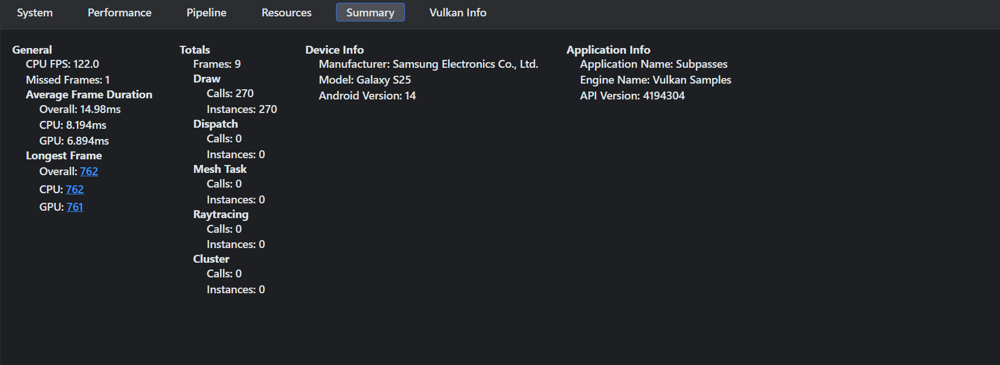

<br>
<br>


## Vulkan information

If you choose to collect Vulkan info when capturing your app, an additional view tab will appear. This provides information related to the Vulkan features and capabilities of the captured device. This is similar to running vulkaninfo.exe on a host machine that supports Vulkan.

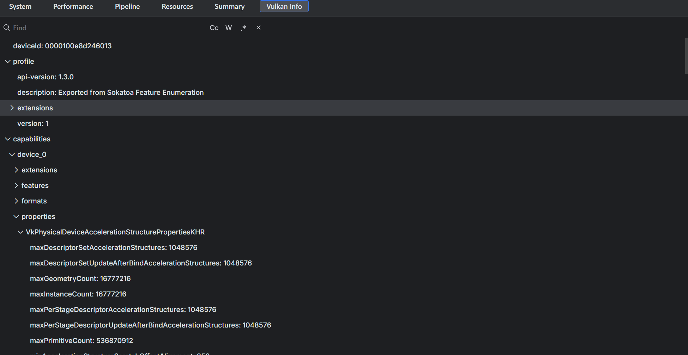

You can also capture Vulkan info on replays; however if you are capturing a replay on the same device as your original capture without any changes to your driver, this is usually unnecessary as the Vulkan info of the baseline capture will be used if one is not present in the replay. If you do not capture Vulkan info in your replay and it is on a different device, the Vulkan info panel will warn you if there is a device id mismatch.

<br>
<br>

## Status Bar

The status bar contains status icons and actions. From left to right:

-   **GFXR Status**: Indicates status of GFXR interactions like replays (red indicates an error has occurred). Clicking on it will open the GFXR output view.
-   **Shader Status**: Indicates status of shader tool interactions like compilation (red indicates an error has occurred). Clicking on it will open the shader output view.
-   **Notifications**: Errors, warnings and information messages are displayed here.
-   **Toggle Bottom Panel**: Show/hide the bottom panel, which by default contains the output view.

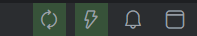